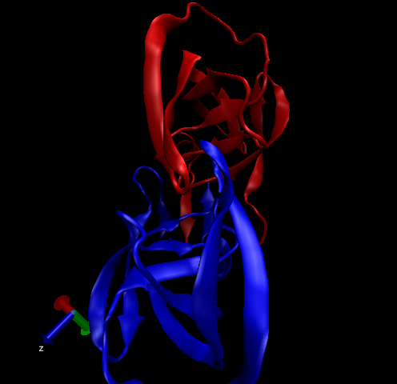

# In the first section, we will interact with the main US based PDB website

First we will export the csv data from the website

```{r}
db <- read.csv("Data Export Summary.csv", row.names=1)
head(db)
View(db)
```

> **Q1: What percentage of structures in the PDB are solved by X-Ray and Electron Microscopy?**

```{r}
method.sums <- colSums(db)
round(method.sums/method.sums["Total"] * 100, 2)
```

87.55% of structures in the PDB are solved of X-ray and 4.92% of structures in the PDB are solved by Electron Microscopy.

> **Q2: What proportion of structures in the PDB are protein?**

```{r}
round(db$Total/method.sums["Total"] * 100,2 )
```

87.36% of structures in the PDB are protein

> **Q3: Type HIV in the PDB website search box on the home page and determine how many HIV-1 protease structures are in the current PDB?**

1828 structures

# VMD structure Visualization Image

# 


> **Q4: Water molecules normally have 3 atoms. Why do we see just one atom per water molecule in this structure?**

It was selected to show not water and not protein.

> **Q5: There is a conserved water molecule in the binding site. Can you identify this water molecule? What residue number does this water molecule have (see note below)?**


# Using Bio3D

```{r}
library(bio3d)

pdb <- read.pdb("1hsg.pdb")
pdb
```
> **Q6 was in the optional section**
> **Q7: How many amino acid residues are there in this pdb object?**

There are 198 amino acid residues.

> **Q8: Name one of the two non-protein residues?**

MK1 is one of the two non-protein residues.

```{r}
attributes(pdb)
```


> **Q9: How many protein chains are in this structure?**

There are two protein chains.


```{r}
#viewing full sequence
pdbseq(pdb)

#viewing amino acid seq
aa123(pdbseq(pdb))
```

The ATOM records

```{r}
head(pdb$atom)
```


# Comparative structure analysis of Adenylate Kinase

The goal of this section is to perform PCA on the complete collection of Adenylate kinase structures in the PDB

```{r}
# Install packages in the R console not your Rmd

#install.packages("bio3d")
#install.packages("ggplot2")
#install.packages("ggrepel")
#install.packages("devtools")
#install.packages("BiocManager")

#BiocManager::install("msa")
#devtools::install_bitbucket("Grantlab/bio3d-view")
```

> **Q10. Which of the packages above is found only on BioConductor and not CRAN?**

msa is found only on BioConductor and not CRAN

> **Q11. Which of the above packages is not found on BioConductor or CRAN?**

bio3d-view

> **Q12. True or False? Functions from the devtools package can be used to install packages from GitHub and BitBucket?**

TRUE


**Search and retrieve ADK structures**

We will perform a blast search of the PDB database to identify related structures to our ADK sequence

```{r}
library(bio3d)
# fetch the query sequence for chain A of the PDB ID 1AKE
aa <- get.seq("1ake_A")
```
```{r}
#viewing query sequence
aa
```
> **Q13. How many amino acids are in this sequence, i.e. how long is this sequence? **

There are 218 amino acids are in this sequence.


BLAST search the PDB to find similar sequences and structures.
```{r}
# Blast or hmmer search 
b <- blast.pdb(aa)
```

```{r}
# Plot a summary of search results
hits <- plot(b)
```


```{r}
# List out some 'top hits'
hits$pdb.id <- c('1AKE_A','4X8M_A','6S36_A','6RZE_A','4X8H_A','3HPR_A','1E4V_A','5EJE_A','1E4Y_A','3X2S_A','6HAP_A','6HAM_A','4K46_A','4NP6_A','3GMT_A','4PZL_A')
```
Identified a number of related PDB sequences to the query sequence.


```{r}
# Download related PDB files
#get.pdb() and pdbslit() to fetch and parse the identified structures.

files <- get.pdb(hits$pdb.id, path="pdbs", split=TRUE, gzip=TRUE)
```


**Align and superpose structures**

```{r}
# Align related PDBs
pdbs <- pdbaln(files, fit = TRUE, exefile="msa")
```

```{r}
# Vector containing PDB codes for figure axis
ids <- basename.pdb(pdbs$id)

# Draw schematic alignment
plot(pdbs, labels=ids)
```
The figure is displaying the schematic representation of alignment. Grey regions depict aligned residues, white regions depict gap regions. The red bar at the top depicts sequence conservation.


**Optional: Viewing our superposed structures**
We can view the superposed results with bio3d.view view() function

```{r}
library(bio3d.view)
library(rgl)

view.pdbs(pdbs)
```
A 3D view of superposed ADK structures popped up.


**Principal component analysis**
```{r}
# Perform PCA
pc.xray <- pca(pdbs)
plot(pc.xray)
```
PCA results on Adenylate kinase X-ray structures. Each dot represents one PDB structure


rmsd() will calculate all pairwise RMSD values of the structural ensemble
```{r}
# Calculate RMSD
rd <- rmsd(pdbs)

# Structure-based clustering
hc.rd <- hclust(dist(rd))
grps.rd <- cutree(hc.rd, k=3)

plot(pc.xray, 1:2, col="grey50", bg=grps.rd, pch=21, cex=1)
```

# Normal mode analysis

nma() provides normal mode analysis which facilitates characterizing and comparing flexibility profiles of related protein structures.

```{r}
# NMA of all structures
modes <- nma(pdbs)
```

```{r}
plot(modes, pdbs, col=grps.rd)
```

> **Q14. What do you note about this plot? Are the black and colored lines similar or different? Where do you think they differ most and why?**

This x axis probably demonstrating the differences in the sequence, in nucleotide binding or amino acids. The black and colored lines are different.  They differ most in residue numbers 125 to 150

